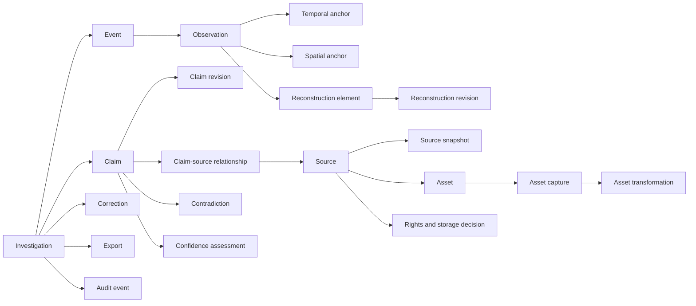

# Data Architecture

Status: WORKING

## Authority model

The authoritative unit is a versioned forensic package containing normalized records and append-only events. Permanent IDs never change. Human-readable slugs are aliases. Search indexes, embeddings, thumbnails, proxies, caches, and rendered reconstruction products are rebuildable derivatives.

## Record types

| Type | Purpose | Append-only/version rule |
|---|---|---|
| Investigation | Bounded research purpose, scope, owners, status | Title/slug may revise; permanent ID remains |
| Event | Occurrence or interval within the investigation | Revisions preserve prior values |
| Claim | Stable identity for a proposition | Text/status changes through claim revisions |
| Claim revision | Exact historical representation | Append-only |
| Source | Publisher/custodian or defined source route | Source history through snapshots |
| Source snapshot | A checked state of source metadata/content locator | Append-only |
| Asset | Logical image, video, document, audio, dataset, or derived artifact | Captures and transformations hold byte history |
| Asset capture | Acquisition, hash, MIME, size, method, and storage state | Append-only; withdrawal changes access state |
| Asset transformation | Input/output hashes, parameters, software, operator | Append-only |
| Entity and alias | Named concept with time-bounded aliases | Merges/splits are events, not ID replacement |
| Observation | Bounded description of measured/perceived evidence | Revision creates a new record or version |
| Temporal anchor | Original and normalized time, system, precision, uncertainty | Preserve original expression and conversion |
| Spatial anchor | Geometry, CRS, method, precision, uncertainty | Derived geometry cites input observations |
| Relationship | Typed function among records | Append revision for status/rationale change |
| Contradiction | Defined incompatibility or discrepancy and alternatives | Resolution appends; original issue remains |
| Rights decision | Allowed acquisition, storage, processing, display, export | Versioned with reviewer and expiry |
| Confidence assessment | Bounded confidence in a proposition under a method | Versioned; never replaces status |
| Reconstruction element/revision | Evidence-linked 2D/3D object or derivation | Inputs and transformations immutable per revision |
| Expert/interview/consent | Private sourcing workflow | Separate access and export boundary |
| Editorial/forensic review | Human review scope, findings, limits | Append-only |
| Correction | Request, decision, and propagation state | Append-only |
| Export | Deterministic package/report manifest | Immutable manifest and hash |
| Import run | Input hash, schema/tool version, result | Append-only |
| Audit event | Material action and prior-event hash | Append-only hash chain |

## Time model

Temporal anchors store:

- original expression;
- normalized UTC instant or `[start, end]` interval;
- source time system (UTC, GMT, mission elapsed time, local civil time, device clock, frame timecode, unknown);
- time zone and daylight-saving interpretation;
- precision and significant digits;
- lower/upper uncertainty in seconds;
- reference epoch or conversion formula;
- clock identity, synchronization/drift notes, and leap-second assumptions;
- method and reviewer; and
- source relationship and locator.

The Apollo fixture retains both NASA mission-elapsed values rather than converting them into a hidden consensus.

## Spatial model

PostgreSQL/PostGIS is the planned deployable authority for spatial anchors. Each geometry stores CRS/SRID, original coordinates, transformation method, precision/error bounds, and evidence links. 3D meshes, point clouds, camera solutions, depth maps, and render caches remain content-addressed derived assets, not opaque database blobs without lineage.

## Storage boundaries

- **Raw captures:** optional restricted object store, shortest retention, body only with documented rights.
- **Normalized records:** relational/portable package state.
- **Derived analysis:** versioned analysis and reconstruction outputs.
- **Annotations:** separate human working notes and labels.
- **Audit/provenance:** append-only events with no raw sensitive body.
- **Expert/consent:** separately permissioned private store.
- **Export staging:** minimal, approval-gated, expiring packages.

## Content addressing

Permitted bytes use SHA-256 content addresses. Logical asset IDs remain stable across captures. A transformation records input hash, output hash, parameters, tool/version, environment, deterministic seed if relevant, and responsible process. Content hashes prove byte identity, not truth or authenticity.

## Deterministic package

Version `1.0.0` packages:

- use JSON Schema 2020-12;
- sort object keys and ID-bearing record arrays for canonical output;
- encode timestamps in RFC 3339 UTC where normalized;
- keep numbers as numbers without hidden locale formatting;
- prohibit unrecognized authoritative record types unless schema-versioned;
- include schema, tool, fixture, and audit-chain versions; and
- emit a SHA-256 manifest for canonical bytes.

## Planned PostgreSQL mapping

The SQL migration mirrors permanent IDs, foreign keys, check constraints, JSONB extension fields, range/time fields, and PostGIS geometry. Append-only tables reject update/delete through database triggers. Object and rights authorization remains enforced by services as well as database roles.
