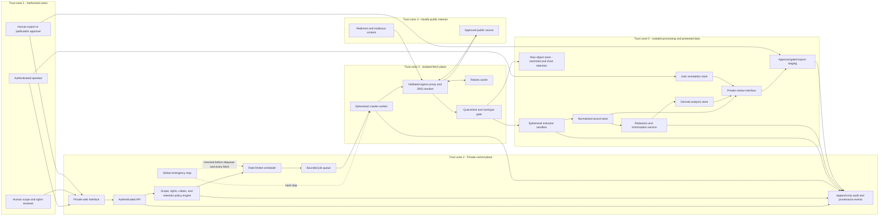

# Data Flow, Permissions, and Trust Boundaries

Status: WORKING

## Data-flow diagram

The hostile internet never connects directly to the control plane or protected stores. The control plane never fetches a user-supplied URL. All outbound traffic passes through the policy-enforcing egress boundary.

## Data classes and movement rules

| Class | Examples | Default retention | Access | Movement restrictions |
|---|---|---|---|---|
| Scope and policy | Approved origins, paths, rights status, robots snapshot, rate and retention rules | Approval lifetime plus audit requirement | Scope approver, security admin, read-only auditor | Versioned; cannot be changed by a worker or analyst |
| Raw capture | Authorized response body and limited headers | No retention by default; short configured period only when rights permit | Extractor service and specially approved reviewer | Never sent to clients, logs, models, or exports by default |
| Normalized record | Metadata, short quotation, dates, source link, extraction result | Task-specific | Analyst and reviewer within object authorization | Must retain raw/provenance reference; personal fields minimized |
| Derived analysis | Timeline relationships, confidence, contradictions | Task-specific and revisable | Analyst and reviewer | Must identify input records, method, version, and whether it is inference |
| User annotation | Notes, labels, corrections, review decisions | Task-specific | Author plus authorized reviewers | Stored separately; never represented as source fact |
| Audit and provenance | Scope decisions, job events, hashes, corrections, exports, deletions | Long enough for accountability; no raw body or secrets | Auditor and security admin; narrow service append rights | Append-only; exports contain only necessary event summaries |
| Export staging | Human-approved minimal package | Very short | Export approver and intended authorized recipient | No public delivery; expires automatically; all accesses logged |

## Trust boundaries

| Boundary | Crossing | Required controls | Failure behavior |
|---|---|---|---|
| User to control plane | Browser or API request | Strong authentication, CSRF protection, input validation, object authorization, session expiry, step-up approval for critical actions | Deny and log minimal event |
| Control plane to job queue | Approved crawl manifest | Signed or integrity-protected job envelope, immutable policy version, budget, retention, requester and approver IDs | Reject job; never infer defaults |
| Job queue to fetch worker | One bounded URL task | Short-lived workload identity, no user credential, emergency-stop check, lease and timeout | Drop lease and stop |
| Fetch worker to internet | DNS and HTTP(S) | Controlled resolver, address validation, egress proxy, TLS validation, allowlist, robots and rate policy, redirect revalidation | Block request and record decision |
| Internet to quarantine | Response headers/body | Byte and time limits, content-type allowlist, streaming hash, decompression limits, no active rendering | Truncate or discard; do not parse |
| Quarantine to extractor | Approved immutable object reference | Separate sandbox, no network, read-only input, resource caps, patched parser | Destroy sandbox and quarantine object |
| Extractor to stores | Structured records and provenance | Schema validation, minimization, redaction, service-scoped write grants, idempotency | Reject transaction; retain error metadata only |
| Protected stores to human review | Private records | Object authorization, purpose binding, masked defaults, access logging, secure transport | Deny access |
| Review to export | Minimal approved package | Two-step human approval, rights/privacy checks, redaction, expiry, manifest and hash | No export |

## Permission map

Legend: `A` approve, `X` execute, `R` read, `W` write within assigned scope, `-` denied.

| Principal | Manage identities/secrets | Approve source scope and rights | Run/stop jobs | View raw | Edit normalized/annotations | Approve export | Read audit | Execute deletion |
|---|---:|---:|---:|---:|---:|---:|---:|---:|
| Security administrator | A | - | emergency stop only | break-glass R | - | - | R | A |
| Scope and rights approver | - | A | - | case-approved R | W decision metadata | - | R | request only |
| Operator | - | - | X within approved manifest | - | - | - | own-job R | request only |
| Analyst | - | - | - | - | R/W derived and annotations | - | limited R | request only |
| Editorial/privacy reviewer | - | - | - | case-approved R | R/W review status | recommend | R | request only |
| Export approver | - | - | - | - | R | A/X | R | - |
| Read-only auditor | - | - | - | - | R | - | R | - |
| Crawler workload | - | - | one leased task | object write only when policy allows | - | - | append own events | - |
| Extractor workload | - | - | - | one object R | normalized object W | - | append own events | - |
| Deletion service | - | - | - | delete by approved manifest | delete/tombstone by manifest | invalidate | append result | X |

No person should hold every approval and execution permission in production. Break-glass access requires a reason, short expiry, alerting, and after-action review. Publication is not a Phase 1 system permission.
